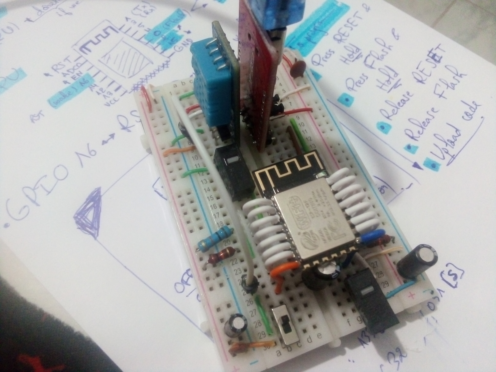
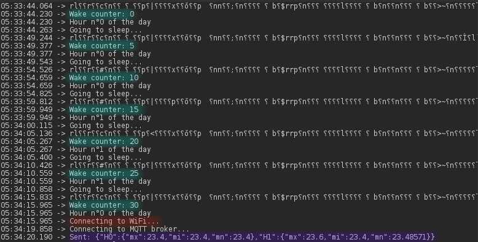
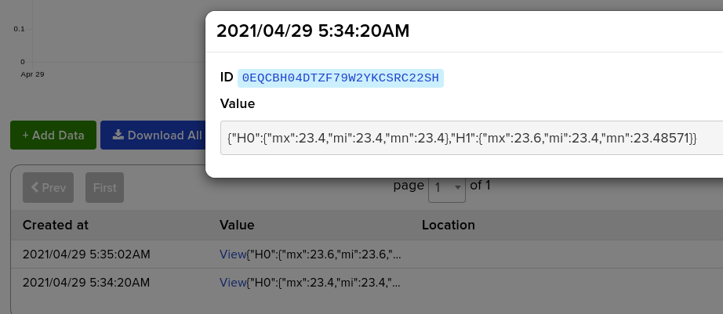
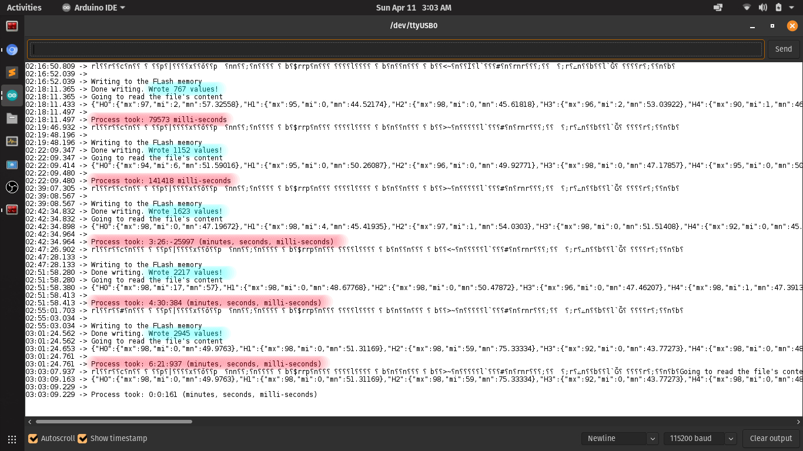

# Temperature logging IoT node

---

## Overview: 

> The real node wired on a breadboard

This is an ultra low power (ULP) temperature logging IoT node based on the ESP8266 MCU, and it sends data in JSON format using MQTT.

This node achieves ULP levels thanks to these tricks:

- Use of a bare-bones 8266 since the use of development boards introduces non-necessary (for deployment) energy consumptions, hence prohibiting the ESP from reaching the 20uA sleep currents claimed by Espressif.

- Use of deep sleep to reduce power consumption as much as possible.

- Turning WiFi ON only when needed, and configuring the ESP to wake up with it OFF.

- Using a static IP address in order to save DHCP dynamic IP allocation time.

- Adopting an edge computing approach, which allows us (with simple, yet smart data processing) to reduce WiFi ON-time to only 6-8 seconds per day, and in the process, save tremendous amounts of energy; longer lasting battery.

**Note**: The use of a DHT11 sensor is temporary since it's not the optimal choice when it comes to low power applications!

---

## Technologies used:

I used MQTT to send the data in JSON format. 

In order to make the data logger, I used the file system of the ESP through the LittleFS library. 

Keeping track of time and successfully sending data each 24h introduced a challenge the moment I thought about deep-sleep, luckily I discovered the RTC (Real Time Clock) memory, which isn't really real-time, but it's accurate enough for temperature logging.

---

## Data provided by the node:

The node sends a JSON file each 24h (approximate, not exactly) that contains 72 values, the **Max**, **Min**, and **Mean** of temperatures for each hour, formatted in this format:

{"H0":{"mx":"Max_value","mi":"Min_value","mn":"Mean_value"},
 
 "H1":{"mx":"Max_value","mi":"Min_value","mn":"Mean_value"},

 .

 .

 .

 "H23":{"mx":"Max_value","mi":"Min_value","mn":"Mean_value"}

}

We don't actually need every temperature in a whole day (well this is what I think) in order to get useful data, and this is why, instead of going the route of sending a value each 30 min to decrease the ON-time, I'd increase the number of data points by waking up each 1 min to read and log the value, then provide an overview of the Temp in that day. In my opinion, the power saving is worth it.

---

## Data visualization:

In addition to the node, I created a desktop app in **Python** to download and visualize the data for me, as well as format it in CSV format.

Project link for the temperature visualizer: [https://github.com/Rad-hi/Temp_log_visualizer](https://github.com/Rad-hi/Temp_log_visualizer)

---

## Data parsing algorithm:

The data logger allows for writing data to the flash and parse it in a specific manner.

How it works:

If it's not the last reading of the hour: Wrtie Temp_value + ','

If it's the last reasing of the hour: Write Temp_value + ',' + '#'

Then the parser reads in the file byte per byte recurcively and with the help of a state machine, parse-in each temp value and for each hour's readings produce:

The max Temp_value of the that hour

The min Temp_value of that hour

The mean of all Temp_value(s) of that hour

PS: After each parsing, the file is erased.

---

## Test:

As shown in the picture below, I slightly modified the code so that it considers 30 passing seconds as a day, and 15 passing seconds as an hour, that way we could test all functionalities in 30 seconds and we end up having 2 hours in our day's data. 

The second picture is taken from adafruit.io and it's the data that was sent by the node.

> The first picture showing the 30 seconds long day

> The second picture showing the data received by adafruit.io

The data parser was tested by incrementing the numnber of temp values written to it. it reached over 2500 values which is way more than enough to contain all day's values. The picture below shows how the data logger/parser works perfectly, and although concurrent writing to the Flash takes a lot of time (notice the time taken to finish each iteration), the parsing process is quite fast as shown in the last iteration that only performs parsing.

> Picture of the incremental file size parsing process

---

## Stats: 

- ON-time to read value and log it: **~60ms**.
- ON-time to parse the day's data and send it: **~7500ms**. (**~150ms** for preparing the data)
- ON-time per day: **~1min, 34s**.
- Power consumption during deep sleep **~20uA**.
- Power consumption during logging (waking up with RF disabled and Wi-Fi never turned ON): **Average: ~40mA**
- Power consumption during sending (Wi-Fi ON): **Average: ~80mA**

---

## Author info:

[Radhi Sghaier on LinkedIn](https://www.linkedin.com/in/radhi-sghaier/)
